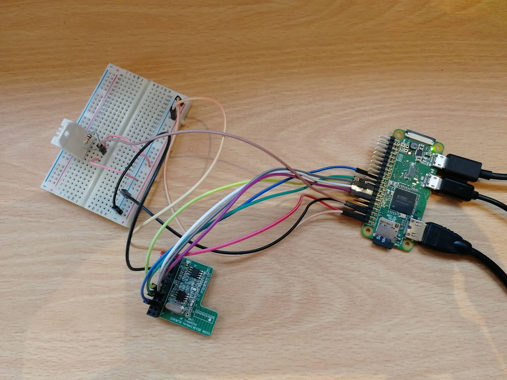
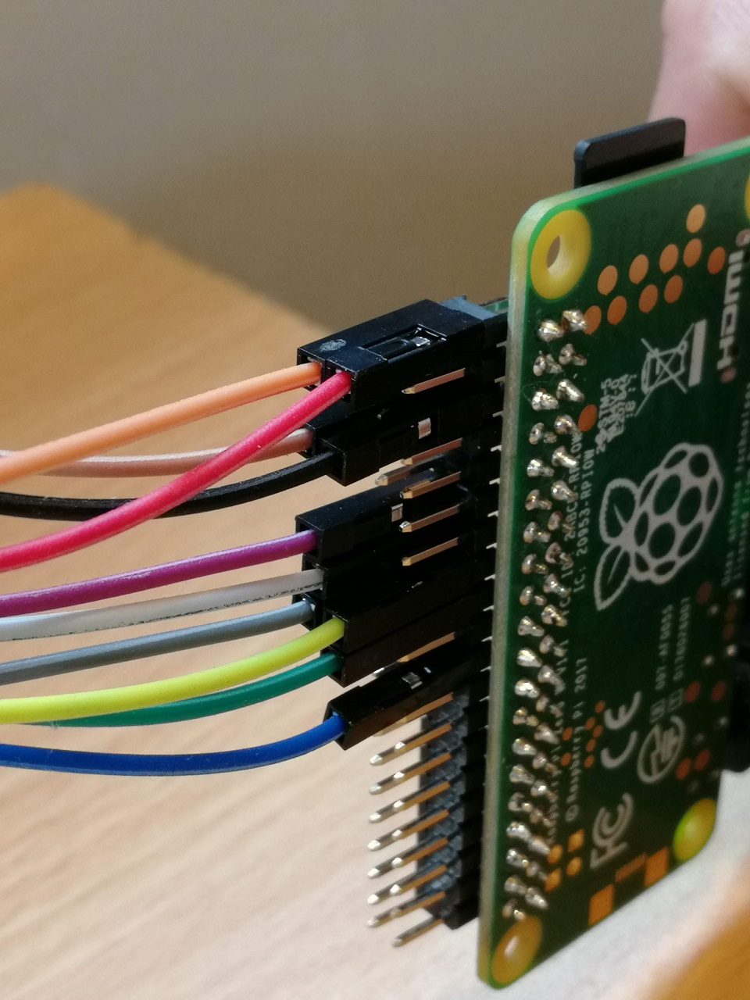

# Raspberry Pi Experiments

Simple home office automation, with:

- [Energenie's Pi-Mote remote control electrical plugs](https://energenie4u.co.uk/catalogue/product/ENER002-2PI)
- AM2302 (DHT22) Digital Temperature Humidity Sensor

## Installation

```
sudo apt install python3-venv
sudo apt install libgpiod2
```

### Adafruit library for using AM2302 (DHT22)

See https://learn.adafruit.com/circuitpython-on-raspberrypi-linux/installing-circuitpython-on-raspberry-pi

### Permissions

The user that everything runs as, requires the following group memberships:

```
sudo adduser carlos gpio
sudo adduser carlos i2c
sudo adduser carlos spi
```

## Virtualenv

```
python3 -m venv .venv
source .venv/bin/activate
pip install -r requirements.txt
```

## Setup the timer

Runs once a minute, taking a temperature and humidity reading and storing it in `/var/log/raspberry-pi-experiments/data.db`. The timer and service call [timer.py].

```
sudo ln -s /home/carlos/raspberry-pi-experiments/raspberry-pi-experiments-timer.service /etc/systemd/system/raspberry-pi-experiments-timer.service
sudo systemctl enable raspberry-pi-experiments-timer
sudo systemctl start raspberry-pi-experiments-timer

sudo ln -s /home/carlos/raspberry-pi-experiments/raspberry-pi-experiments-timer.timer /etc/systemd/system/raspberry-pi-experiments-timer.timer
sudo systemctl enable raspberry-pi-experiments-timer.timer
sudo systemctl start raspberry-pi-experiments-timer.timer
```

## Setup the web server

```
sudo ln -s /home/carlos/raspberry-pi-experiments/raspberry-pi-experiments-web.service /etc/systemd/system/raspberry-pi-experiments-web.service
sudo systemctl enable raspberry-pi-experiments-web
sudo systemctl start raspberry-pi-experiments-web
```

### View the web server log

```
sudo journalctl -u raspberry-pi-experiments-web -f
```

## Hardware



Note: The mapping of BCM to BOARD pin references was thanks to this great site: https://pinout.xyz/

The Adafruit Python library set's the GPIO mode to BCM and it's not possible to change the mode once set in a process. So I've updated the Energenie Pi-mote code to support both.


